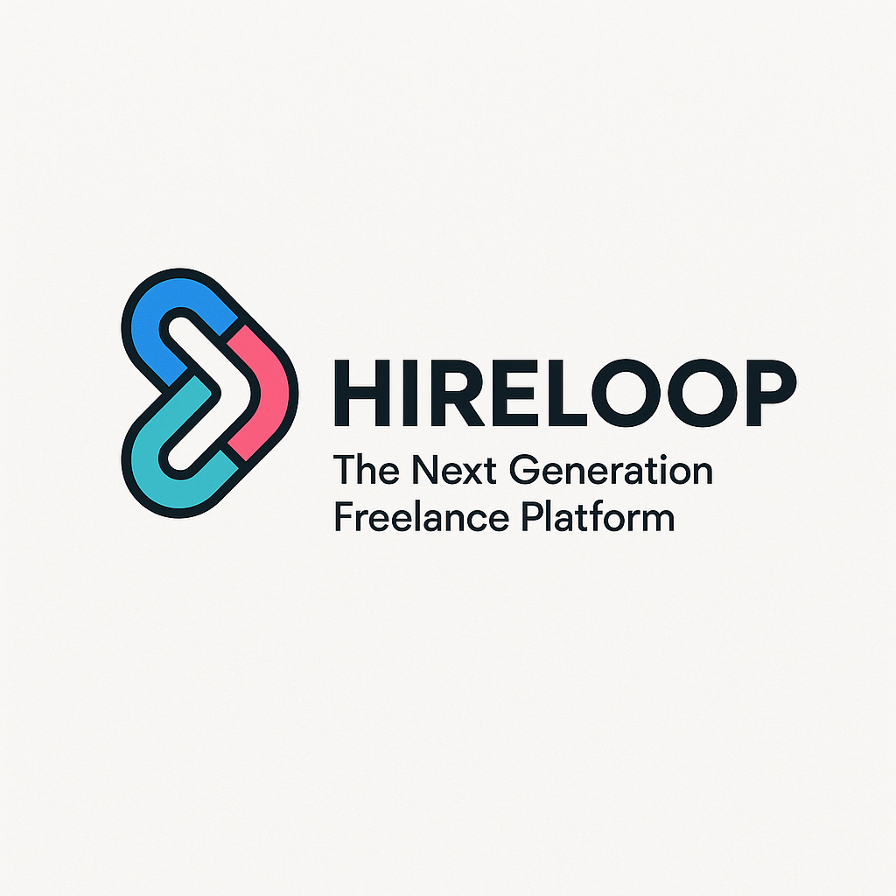
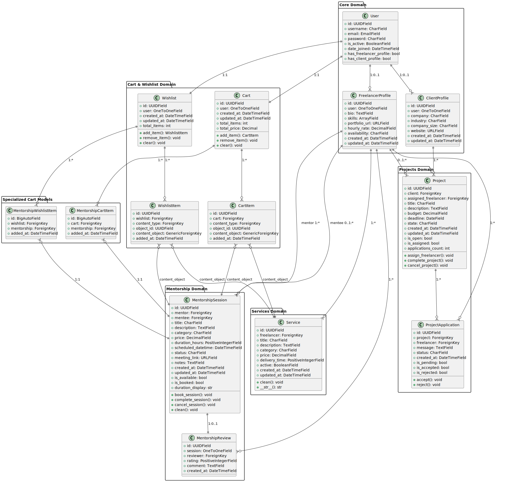
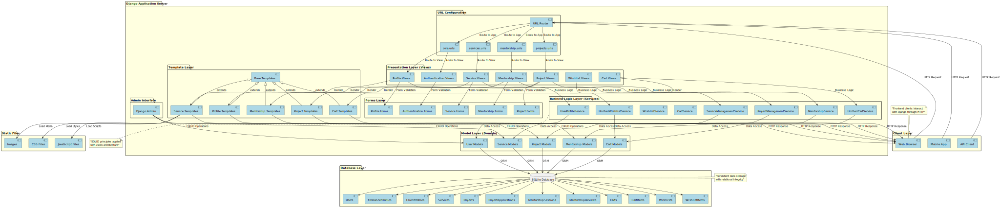

# HireLoop - Plataforma de Freelancing y Mentoría

## Tabla de Contenidos

- [Información del Proyecto](#información-del-proyecto)
- [Entregable #1 - Arquitectura MVT](#entregable-1---arquitectura-mvt)
  - [Logo del Equipo](#logo-del-equipo)
  - [Modelo Verbal Definitivo](#modelo-verbal-definitivo)
  - [Diagrama de Clases](#diagrama-de-clases)
  - [Diagrama de Arquitectura MVT](#diagrama-de-arquitectura-mvt)
- [Guía de Estilo de Programación](#guía-de-estilo-de-programación)
- [Reglas de Programación](#reglas-de-programación)
- [Funcionalidades Interesantes](#funcionalidades-interesantes)
- [Pantallazos de la Aplicación](#pantallazos-de-la-aplicación)
- [Implementación en Django](#implementación-en-django)
- [Instrucciones de Entrega](#instrucciones-de-entrega)

---

## Información del Proyecto

### Equipo de Desarrollo
**Nombre del Equipo:** DevLoop Solutions  
**Proyecto:** HireLoop - Plataforma de Freelancing y Mentoría

### Integrantes
- **Arquitecto de Software, desarrollador Backend, desarrollador Frotend:** Samuel Andrés Ariza Gómez

### Descripción del Proyecto
HireLoop es una plataforma web innovadora que conecta freelancers con clientes y mentores, facilitando la colaboración en proyectos y el intercambio de conocimientos. La aplicación integra tres funcionalidades principales: servicios freelance, gestión de proyectos y sesiones de mentoría, todo bajo una arquitectura MVT robusta y escalable implementada en Django 4.2.

La plataforma maneja múltiples dominios de negocio incluyendo gestión de usuarios con perfiles duales (freelancer/cliente), un sistema unificado de carrito y wishlist que soporta tanto servicios como mentorías, y un complejo sistema de estados para proyectos y sesiones de mentoría.

---

## Entregable #1 - Arquitectura MVT

### Logo del Equipo


### Modelo Verbal Definitivo

#### Descripción del Proyecto
HireLoop es una plataforma integral de freelancing y mentoría que revoluciona la forma en que profesionales independientes y clientes colaboran en proyectos digitales. La aplicación facilita la conexión entre tres tipos de usuarios principales: freelancers, clientes y mentores, creando un ecosistema completo de servicios profesionales.

#### Alcance del Sistema
La plataforma abarca las siguientes áreas funcionales:

**1. Gestión de Usuarios y Perfiles**
- Sistema de autenticación robusto con roles diferenciados
- Perfiles duales: FreelancerProfile y ClientProfile vinculados a un User base
- Gestión de habilidades, portafolios y experiencia profesional
- Validaciones personalizadas y propiedades calculadas para verificación de tipos de perfil

**2. Servicios Freelance**
- Catálogo de servicios con categorización avanzada
- Sistema de precios flexibles y tiempos de entrega configurables
- Gestión de disponibilidad y estados de servicios (activo/inactivo)
- Integración con sistema unificado de carrito y wishlist

**3. Gestión de Proyectos**
- Creación y administración de proyectos por parte de clientes
- Sistema de aplicaciones de freelancers a proyectos con estados (PENDING, ACCEPTED, REJECTED)
- Seguimiento de estados de proyecto: OPEN, IN_PROGRESS, COMPLETED, CANCELLED
- Asignación automática de freelancers y transiciones de estado controladas

**4. Plataforma de Mentoría**
- Sesiones de mentoría personalizadas con categorización flexible
- Sistema de reservas y programación con validaciones de disponibilidad
- Gestión de evaluaciones y retroalimentación mediante MentorshipReview
- Estados de sesión: AVAILABLE, BOOKED, COMPLETED, CANCELLED

**5. Sistema de Carrito y Favoritos Unificado**
- Carrito de compras que maneja servicios y mentorías usando Generic Foreign Keys
- Lista de favoritos (wishlist) integrada con soporte para múltiples tipos de contenido
- Arquitectura genérica para extensibilidad futura
- Modelos especializados adicionales para relaciones directas (MentorshipCartItem, MentorshipWishlistItem)

#### Actores del Sistema
- **Freelancers:** Profesionales que ofrecen servicios y pueden actuar como mentores
- **Clientes:** Empresas o individuos que requieren servicios profesionales y crean proyectos
- **Mentores:** Expertos que brindan sesiones de mentoría (pueden ser freelancers con perfil dual)
- **Administradores:** Gestores de la plataforma con acceso completo al sistema via Django Admin

#### Beneficios
- **Para Freelancers:** Plataforma unificada para ofrecer servicios y mentoría con gestión integral de perfil
- **Para Clientes:** Acceso a talento especializado con gestión simplificada de proyectos y aplicaciones
- **Para Mentores:** Oportunidad de monetizar conocimientos y experiencia con sistema de reservas robusto
- **Para la Industria:** Ecosistema que fomenta el crecimiento profesional continuo y la colaboración

### Diagrama de Clases


El diagrama de clases muestra la arquitectura del dominio de negocio, incluyendo:
- **Dominio Central:** User como entidad base con relaciones uno-a-uno opcionales hacia FreelancerProfile y ClientProfile
- **Dominio de Servicios:** Service con relación directa al FreelancerProfile y validaciones de negocio
- **Dominio de Proyectos:** Project y ProjectApplication con máquina de estados y flujos de trabajo completos
- **Dominio de Mentoría:** MentorshipSession y MentorshipReview con gestión completa del ciclo de vida
- **Sistema Unificado de Carrito/Wishlist:** Implementación genérica usando ContentType para máxima extensibilidad

### Diagrama de Arquitectura MVT


La arquitectura MVT (Model-View-Template) de Django implementada incluye:
- **Capa de Presentación:** Views organizadas por aplicación con separación clara de responsabilidades
- **Capa de Lógica de Negocio:** Services que encapsulan reglas de negocio siguiendo principios SOLID
- **Capa de Datos:** Models con integridad referencial, validaciones robustas y UUIDs como claves primarias
- **Capa de Templates:** Sistema de plantillas jerárquico con herencia y reutilización de componentes

---

## Guía de Estilo de Programación

### Estándar Principal: PEP 8
El proyecto sigue estrictamente las convenciones de [PEP 8](https://pep8.org/) para Python, asegurando consistencia y legibilidad del código en todo el proyecto.

### Convenciones Específicas del Proyecto

#### Nomenclatura
```python
# Clases: PascalCase
class FreelancerProfile(models.Model):
    pass

class MentorshipSession(models.Model):
    pass

# Funciones y variables: snake_case
def create_mentorship_session(mentor, **kwargs):
    mentorship_data = kwargs.get('data')
    return mentorship_data

def add_to_wishlist(user, content_object):
    pass

# Constantes: UPPER_SNAKE_CASE
DEFAULT_PRICE = 100.00
MAX_DESCRIPTION_LENGTH = 500
AVAILABLE = 'AVAILABLE'
BOOKED = 'BOOKED'
```

#### Documentación
```python
def add_to_wishlist(self, user, content_object):
    """
    Agrega un item genérico a la wishlist del usuario.
    
    Args:
        user: Usuario propietario de la wishlist
        content_object: Objeto a agregar (Service o MentorshipSession)
        
    Returns:
        WishlistItem: Item creado o existente
        
    Raises:
        ValidationError: Si el objeto no está disponible
    """
    pass
```

### Organización de Imports
```python
# Imports estándar de Python
from datetime import datetime
import uuid

# Imports de Django
from django.db import models
from django.contrib.auth.models import AbstractUser
from django.contrib.contenttypes.models import ContentType
from django.contrib.contenttypes.fields import GenericForeignKey

# Imports de terceros
from rest_framework import serializers

# Imports locales
from core.models import User
from .services import MentorshipService
```

---

## Reglas de Programación

### Modelos (Models)
1. **Principio de Responsabilidad Única:** Cada modelo representa una entidad específica del dominio
2. **UUIDs como Claves Primarias:** Usar `UUIDField` para seguridad y escalabilidad
3. **Validaciones:** Implementar `clean()` para validaciones complejas de negocio
4. **Metadatos:** Definir `Meta` class con `verbose_name`, `ordering` y `unique_together`
5. **Timestamps:** Incluir `created_at` y `updated_at` automáticos en todos los modelos

```python
class MentorshipSession(models.Model):
    id = models.UUIDField(primary_key=True, default=uuid.uuid4, editable=False)
    created_at = models.DateTimeField(auto_now_add=True)
    updated_at = models.DateTimeField(auto_now=True)
    
    def clean(self):
        """Validaciones del modelo"""
        if self.scheduled_datetime and self.scheduled_datetime <= timezone.now():
            raise ValidationError("La fecha de la sesión debe ser futura")
    
    class Meta:
        verbose_name = 'Sesión de Mentoría'
        ordering = ['-created_at']
```

### Vistas (Views)
1. **Class-Based Views:** Preferir CBV sobre FBV para reutilización y herencia
2. **Mixins:** Usar `LoginRequiredMixin` para autenticación obligatoria
3. **Separación de Responsabilidades:** Una vista, una responsabilidad específica
4. **Manejo de Errores:** Implementar try-catch con mensajes informativos para el usuario
5. **Dispatch Override:** Validar permisos en el método `dispatch`

```python
class CreateMentorshipView(LoginRequiredMixin, FormView):
    template_name = 'mentorship/create_mentorship.html'
    form_class = MentorshipSessionForm
    
    def dispatch(self, request, *args, **kwargs):
        if not request.user.has_freelancer_profile:
            messages.error(request, "Solo los freelancers pueden crear mentorías")
            return redirect('core:multi_profile_detail')
        return super().dispatch(request, *args, **kwargs)
```

### Servicios (Services)
1. **Encapsulación:** Lógica de negocio en clases de servicio especializadas
2. **Principios SOLID:** Cada servicio tiene una responsabilidad específica y bien definida
3. **Manejo de Errores:** Validaciones antes de operaciones críticas
4. **Transacciones:** Usar `@transaction.atomic` para operaciones complejas que involucran múltiples modelos

### Templates
1. **Herencia:** Usar `` para estructura común
2. **Bloques Semánticos:** Definir bloques claros (``, ``)
3. **Includes:** Componentes reutilizables con ``
4. **Filtros y Tags:** Usar filtros de Django para formateo de datos

### URLs
1. **Nombres Descriptivos:** Usar `name` descriptivos para todas las URLs
2. **Namespaces:** Organizar por aplicación (`app_name = 'mentorship'`)
3. **RESTful:** Seguir convenciones REST cuando sea apropiado
4. **Tipos de Parámetros:** Usar tipos específicos (`<uuid:pk>`, `<uuid:mentorship_id>`)

---

## Funcionalidades Interesantes

### 1. Sistema Unificado de Carrito y Wishlist con Generic Foreign Keys
**Descripción:** Implementación genérica que permite agregar tanto servicios como mentorías al carrito y lista de favoritos usando Django's ContentType framework, complementado con modelos especializados para relaciones directas.

**Archivos principales:**
- [`core/services/cart_service.py`](core/services/cart_service.py) - Línea 1: Servicio unificado de carrito
- [`core/services/wishlist_service.py`](core/services/wishlist_service.py) - Línea 1: Servicio unificado de wishlist
- [`services/models.py`](services/models.py) - Línea 152: Modelo Wishlist con Generic Foreign Keys
- [`mentorship/models.py`](mentorship/models.py) - Línea 198: MentorshipWishlistItem especializado

**Valor técnico:** Demuestra el uso avanzado de Generic Foreign Keys y principios SOLID para crear una solución extensible que puede manejar cualquier tipo de contenido futuro.

### 2. Arquitectura de Servicios con Principios SOLID
**Descripción:** Implementación completa de una capa de servicios que encapsula la lógica de negocio, siguiendo el principio de responsabilidad única y facilitando el testing, mantenimiento y escalabilidad.

**Archivos principales:**
- [`core/services/`](core/services/) - Directorio completo con servicios especializados
- [`mentorship/views.py`](mentorship/views.py) - Línea 330: Uso de MentorshipService en CreateMentorshipView
- [`projects/views.py`](projects/views.py) - Línea 151: ProjectManagementService en CreateProjectView
- [`services/views.py`](services/views.py) - Línea 493: UnifiedCartService en UnifiedCartView

**Valor técnico:** Separación clara entre lógica de presentación y lógica de negocio, facilitando testing unitario y mantenimiento del código.

### 3. Sistema de Estados y Flujos de Trabajo con Validaciones
**Descripción:** Implementación robusta de máquinas de estado para proyectos y mentorías, con transiciones controladas, validaciones de negocio y propiedades calculadas para verificación de estados.

**Archivos principales:**
- [`projects/models.py`](projects/models.py) - Línea 43: Propiedades de estado de Project (is_open, is_assigned)
- [`mentorship/models.py`](mentorship/models.py) - Línea 62: Estados de MentorshipSession con validaciones
- [`projects/models.py`](projects/models.py) - Línea 94: ProjectApplication con estados y transiciones
- [`projects/models.py`](projects/models.py) - Línea 75: Métodos de transición assign_freelancer()

**Valor técnico:** Gestión profesional de estados de entidades con validaciones de negocio robustas y transiciones controladas.

### 4. Sistema de Validaciones Personalizadas Multi-Nivel
**Descripción:** Implementación de validaciones complejas tanto a nivel de modelo como de formulario, incluyendo validaciones cross-field, reglas de negocio y validaciones temporales.

**Archivos principales:**
- [`mentorship/models.py`](mentorship/models.py) - Línea 92: Método clean con validaciones de fecha y disponibilidad
- [`services/models.py`](services/models.py) - Línea 173: Validaciones de wishlist con verificación de disponibilidad
- [`projects/models.py`](projects/models.py) - Línea 43: Validaciones de asignación de freelancer
- [`mentorship/models.py`](mentorship/models.py) - Línea 155: Validaciones de MentorshipReview

**Valor técnico:** Garantiza integridad de datos y cumplimiento de reglas de negocio complejas a múltiples niveles de la aplicación.

---

## Pantallazos de la Aplicación

### Dashboard Principal y Navegación


### Sistema de Mentorías - Lista y Detalle


### Gestión de Proyectos - Creación y Aplicaciones


---

## Implementación en Django

### Configuración Inicial del Repositorio

#### 1. Creación del Repositorio en GitHub
```bash
# Crear repositorio en GitHub con nombre: hireloop-platform
# Clonar repositorio localmente
git clone https://github.com/username/hireloop-platform.git
cd hireloop-platform
```

#### 2. Configuración del Proyecto Django 4.2
```bash
# Crear entorno virtual
python -m venv venv
source venv/bin/activate  # En Windows: venv\Scripts\activate

# Instalar Django 4.2 LTS y dependencias
pip install django==4.2
pip install -r requirements.txt

# Crear proyecto Django
django-admin startproject hireloop .

# Crear aplicaciones principales
python manage.py startapp core        # Usuarios y autenticación
python manage.py startapp services   # Servicios freelance
python manage.py startapp projects   # Gestión de proyectos
python manage.py startapp mentorship # Sistema de mentorías
python manage.py startapp analytics  # Métricas y reportes
python manage.py startapp payments   # Procesamiento de pagos
```

#### 3. Configuración de Base de Datos y Migraciones
```bash
# Realizar migraciones iniciales
python manage.py makemigrations
python manage.py migrate

# Crear superusuario
python manage.py createsuperuser

# Generar datos ficticios usando management commands
python manage.py shell
>>> from core.factories import create_sample_data
>>> create_sample_data()

# Exportar esquema SQL para documentación
python manage.py sqlmigrate core 0001 > database_schema.sql
python manage.py sqlmigrate mentorship 0001 >> database_schema.sql
```

#### 4. Implementación del Sistema de Autenticación

**Usuario Personalizado con Propiedades Calculadas:**
```python
# core/models.py
class User(AbstractUser):
    id = models.UUIDField(primary_key=True, default=uuid.uuid4, editable=False)
    
    @property
    def has_freelancer_profile(self):
        return hasattr(self, 'freelancerprofile')
    
    @property
    def has_client_profile(self):
        return hasattr(self, 'clientprofile')
```

**Sistema de Login Multi-Rol:**
- Login para usuarios regulares con redirección inteligente según perfil
- Dashboard administrativo personalizado con Django Admin
- Middleware de autenticación integrado con sistema de perfiles duales

### Principios de Organización

#### DRY (Don't Repeat Yourself)
- **Templates:** Sistema de herencia jerárquico con `base.html` y templates especializados
- **Services:** Lógica de negocio reutilizable encapsulada en servicios SOLID
- **Forms:** Formularios base con validaciones comunes y herencia
- **Models:** Campos y métodos comunes en modelos abstractos

#### ETC (Easier to Change)
- **Configuración:** Settings separados por ambiente (development, staging, production)
- **URLs:** Estructura modular por aplicación con namespaces claros
- **Static Files:** Organización por funcionalidad y componentes reutilizables
- **Generic Relations:** Uso de ContentType para extensibilidad futura

### Estructura de Archivos del Proyecto
```
hireloop-platform/
├── db_new.sqlite3                              # Database file
├── doc.md                                      # Main documentation file
├── manage.py                                   # Django management script
├── requirements.txt                            # Python dependencies
├── wiki.md                                     # Wiki documentation (if created)
│
├── analytics/                                  # Analytics application
│   ├── __init__.py
│   ├── admin.py
│   ├── apps.py
│   ├── models.py
│   ├── tests.py
│   ├── urls.py
│   └── views.py
│
├── core/                                       # Core application (users, profiles, base services)
│   ├── __init__.py
│   ├── admin.py
│   ├── apps.py
│   ├── context_processors.py
│   ├── forms.py
│   ├── mixins.py
│   ├── models.py
│   ├── services.py                             # Main services file
│   ├── signals.py
│   ├── tests.py
│   ├── urls.py
│   ├── views.py
│   ├── __pycache__/                           # Python cache files
│   ├── factories/                             # Data factories for testing
│   ├── management/                            # Django management commands
│   ├── migrations/                            # Database migrations
│   ├── mixins/                               # Custom mixins
│   ├── models/                               # Separated model files
│   ├── repositories/                         # Repository pattern implementations
│   ├── services/                             # Service layer implementations
│   │   ├── __init__.py
│   │   ├── cart_service.py
│   │   ├── wishlist_service.py
│   │   ├── freelancer_project_service.py
│   │   └── [other service files]
│   ├── templates/                            # Core templates
│   │   └── core/
│   │       ├── dashboard.html
│   │       ├── freelancer_projects.html
│   │       ├── login.html
│   │       ├── multi_profile_detail.html
│   │       └── [other core templates]
│   └── validators/                           # Custom validators
│
├── docs/                                      # Documentation and diagrams
│   ├── arquitecture.plantuml                 # Architecture PlantUML diagram
│   ├── class_diagram.plantuml               # Class diagram PlantUML
│   ├── HireLoop_Class_Diagram.svg           # Generated class diagram
│   ├── HireLoop_MVT_Architecture.svg        # Generated architecture diagram
│   ├── logo/                                # Logo assets
│   │   └── logo.png
│   └── screenshots/                         # Application screenshots
│       ├── dashboard.png
│       ├── mentorship_list.png
│       └── projects_management.png
│
├── hireloop/                                 # Django project settings
│   ├── __init__.py
│   ├── settings.py
│   ├── urls.py
│   ├── wsgi.py
│   └── asgi.py
│
├── mentorship/                               # Mentorship application
│   ├── __init__.py
│   ├── admin.py
│   ├── apps.py
│   ├── cart_models.py                       # Moved to models.py (deprecated)
│   ├── forms.py
│   ├── models.py
│   ├── services.py
│   ├── tests.py
│   ├── urls.py
│   ├── views.py
│   ├── migrations/                          # Database migrations
│   └── templates/                           # Mentorship templates
│       └── mentorship/
│           ├── mentor_list.html
│           ├── session_detail.html
│           ├── session_list.html
│           ├── create_mentorship.html
│           └── [other mentorship templates]
│
├── payments/                                 # Payments application
│   ├── __init__.py
│   ├── admin.py
│   ├── apps.py
│   ├── models.py
│   ├── tests.py
│   ├── urls.py
│   └── views.py
│
├── projects/                                 # Projects management application
│   ├── __init__.py
│   ├── admin.py
│   ├── apps.py
│   ├── forms.py
│   ├── models.py
│   ├── services.py                          # Moved to core/services.py
│   ├── tests.py
│   ├── urls.py
│   ├── views.py
│   ├── migrations/                          # Database migrations
│   └── templates/                           # Project templates
│       └── projects/
│           ├── project_list.html
│           ├── project_detail.html
│           ├── create_project.html
│           ├── client_projects.html
│           └── [other project templates]
│
├── services/                                 # Services/freelance application
│   ├── __init__.py
│   ├── admin.py
│   ├── apps.py
│   ├── forms.py
│   ├── models.py
│   ├── tests.py
│   ├── urls.py
│   ├── views.py
│   ├── migrations/                          # Database migrations
│   └── templates/                           # Service templates
│       └── services/
│           ├── service_list.html
│           ├── service_detail.html
│           ├── cart.html
│           ├── wishlist.html
│           ├── unified_cart.html
│           └── [other service templates]
│
├── templates/                                # Global templates
│   ├── base.html                            # Base template
│   ├── partials/                            # Reusable template components
│   │   ├── navbar.html
│   │   ├── footer.html
│   │   └── messages.html
│   └── registration/                        # Authentication templates
│       ├── login.html
│       ├── register.html
│       └── password_reset.html
│
├── static/                                   # Static files
│   ├── css/                                 # Stylesheets
│   │   ├── base.css
│   │   ├── dashboard.css
│   │   ├── mentorship.css
│   │   └── [other CSS files]
│   ├── js/                                  # JavaScript files
│   │   ├── base.js
│   │   ├── cart.js
│   │   └── [other JS files]
│   └── images/                              # Image assets
│       ├── logo.png
│       └── [other images]
│

```

### Cabecera Obligatoria de Archivos
Cada archivo Python debe incluir la cabecera estándar:
```python
"""
Archivo: mentorship/models.py
Autor: [Nombre del Desarrollador]
Fecha: [Fecha de Creación]
Descripción: Modelos del dominio de mentoría con validaciones de negocio
Aplicación: HireLoop Platform - Sistema de Mentoría
Versión: 1.0
"""
```

### Rol del Arquitecto de Software

#### Responsabilidades Principales:
1. **Revisión Obligatoria de Commits:** Todos los commits deben ser revisados y aprobados antes del merge
2. **Estándares de Código:** Verificar cumplimiento estricto de PEP 8 y reglas del proyecto
3. **Arquitectura:** Asegurar coherencia con el diseño MVT y principios SOLID establecidos
4. **Documentación:** Mantener actualizada la documentación técnica y arquitectural
5. **Code Review:** Evaluar calidad, performance y adherencia a patrones establecidos

#### GitHub Projects para Organización:
- **Backlog:** Funcionalidades priorizadas por implementar
- **In Progress:** Desarrollo activo con asignación clara
- **Review:** Pendientes de revisión arquitectural obligatoria
- **Testing:** En proceso de pruebas y validación
- **Done:** Funcionalidades completadas, probadas y desplegadas

#### Flujo de Trabajo Git:
```bash
# 1. Crear rama específica para feature
git checkout -b feature/mentorship-booking-system

# 2. Desarrollar con commits descriptivos y frecuentes
git commit -m "feat: implement mentorship booking validation logic"
git commit -m "test: add unit tests for booking service"
git commit -m "docs: update mentorship API documentation"

# 3. Push y crear Pull Request con template
git push origin feature/mentorship-booking-system

# 4. Arquitecto revisa código, arquitectura y documentación
# 5. Aprobación y merge a main branch con squash si necesario
```

---


*Documentación generada para HireLoop Platform - DevLoop Solutions Team*  
*Versión 1.0 - Entregable #1 Arquitectura MVT*  
*Tópicos Especiales en Ingeniería de Software*